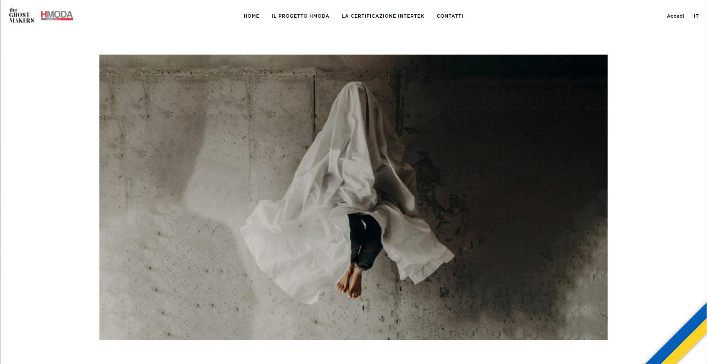

# ukraine-banner

This is a **web component** that provides a **simple banner against the war in Ukraine**. 

## Usage

On the [releases](https://github.com/euberdeveloper/ukraine-banner/releases) you can download the file `ukraine-banner.tar.gz`. Inside, there will be a README.md with the js files implementing the webcomponent. The **umd** version is just **6KB**, so very light.

The **tag name** is `<ukraine-ribbon>` and it accepts the following options:

| **Property** | **Required** | **Default**                | **Description**                                                                                                             |
| ------------ | ------------ | -------------------------- | --------------------------------------------------------------------------------------------------------------------------- |
| vertical     | NO           | 'bottom'                   | It says if the ribbon will be on the top or on the bottom. (Possible values: 'top' and 'bottom').                           |
| horizontal   | NO           | 'right'                    | It says if the ribbon will be on the left or on the right. (Possible values: 'left' and 'right').                           |
| href         | NO           | undefined                  | It says the url where the user will be redirected after clicking the ribbon. If not specified, the ribbon is not clickable. |
| title        | NO           | undefined                  | It says the title that will be displayed when the mouse is over the ribbon.                                                 |
| height       | NO           | '3vw'                      | It says the height of the ribbon.                                                                                           |
| boxshadow    | NO           | '0 0 8px rgb(0 0 0 / 50%)' | It says the box shadow that the ribbon will have.                                                                           |
| zindex       | NO           | '999999'                   | It says the z-index of the ribbon                                                                                           |

## Example

```html
<!DOCTYPE html>
<html lang="en">

<head>
    <meta charset="UTF-8">
    <meta http-equiv="X-UA-Compatible" content="IE=edge">
    <meta name="viewport" content="width=device-width, initial-scale=1.0">
    <!-- NOTE THAT HERE THE ADDRESS TO THE JS FILE IS RELATIVE AND THAT YOU MAY NEED TO CHANGE THE VERSION IN THE FILE NAME -->
    <script src="./ukraine-banner.umd.1.0.0.js"></script>
    <title>Ukraine Banner Example</title>
</head>

<body>
    <ukraine-ribbon vertical="top" horizontal="left" href="https://www.stopputin.net/"></ukraine-ribbon>
</body>

</html>
```

## Result

The result will be something like this (you can see the ribbon added in the bottom right corner of the page):



## How was it made

This web component was made with **Typescript**, **Svelte** and **Vite**.